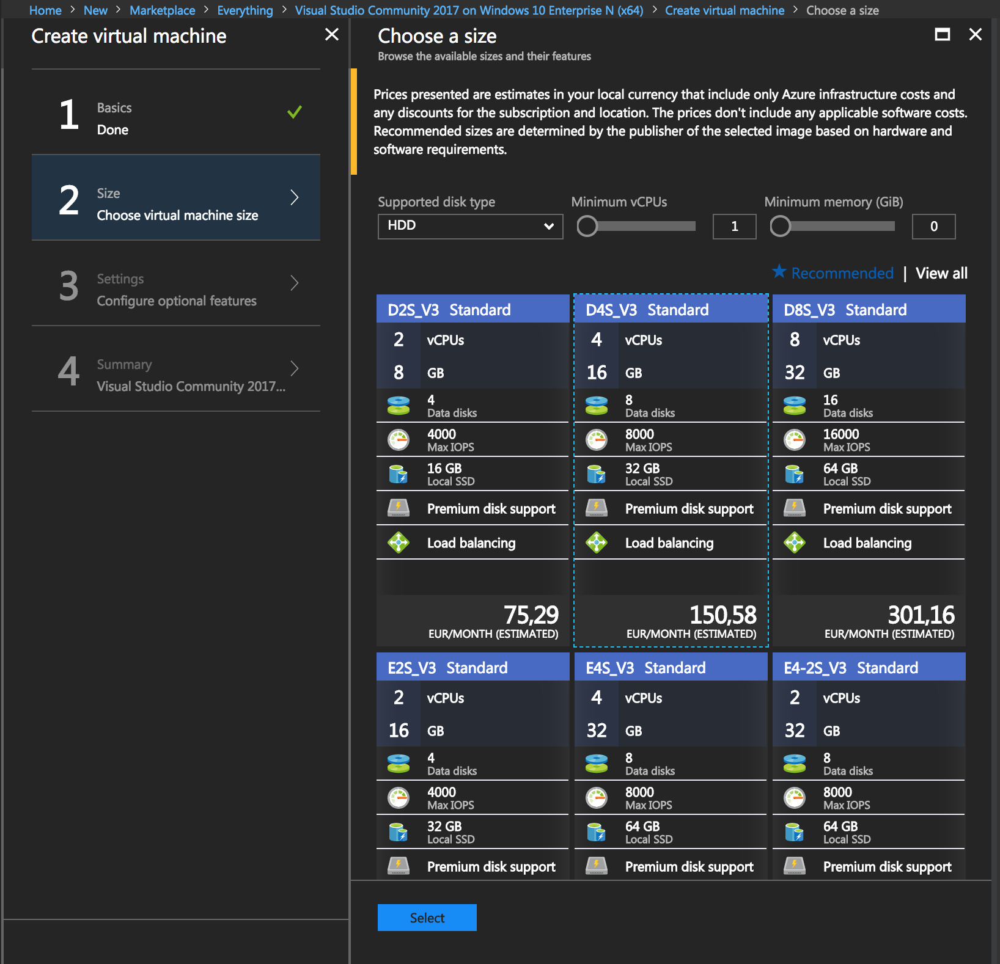

# Maszyny wirtualne

## Mój pierwszy zasób

Zacznijmy od  stworzenia sobie zdalnego miejsce pracy, do którego możemy połączyć się z dowolnego innego komputera \(bądź telefonu\). Nie musisz już nosić ze sobą swojego laptopa - wszystkie swoje pliki i programy będą dla Ciebie dostępne na każdym komputerze, którego użyjesz!

Stwórzmy nowy zasób klikając na "Utwórz zasów" w lewym górnym rogu. 

Następnie wyszukajmy na Azure Marketplace zasób, który nas interesuje:

```text
Visual Studio Community 2017 on Windows Server
```


Klikamy create i wypełniamy konfigurację:


Następnie parametry hardware - główny składnik kosztu zasobu:



Po poprawnym zakończeniu konfiguracji rozpoczyna się wdrożenie zasobu. Trwa około **5 minut**, po czym widzimy ekran podsumowania maszyny wirtualnej:



Podczas tworzenia maszyny wirtualnej możesz użyć istniejącej podsieci i połączyć kilka maszyn wirtualnych w sieć LAN.


Warto zapoznać się z narzędziami dostępnymi po lewej stronie ekranu głównego zasobu.

## Konfiguracja i połączenie

Następnym krokiem jest połączenie się za pośrednictwem protokołu RDP - _Remote Desktop Protocol_.

Aby nawiązać połączenie, połącz się z maszyną używając **publicznego adresu IP** \(widoczny na ekranie głównym zasobu\) i aplikacji obsługującej RDP:

* **Windows**: _Zdalny pulpit_ \(ang. Remote desktop\),
* **OS X**: _Microsoft Remote Desktop_
* **Linux**: _Remmina,_
* **Android**: _Microsoft Remote Desktop_


Maszyny wirtualne z systemem Linux mają domyślnie uruchomioną usługę **SSH** i zaporę firewall zezwalającą na te połączenie.


## Twój workspace

Na maszynie wirtualnej znajduje się już gotowe do użycia Visual Studio. Wykorzystamy je do stworzenia aplikacji webowej w następnym roku. 


Pamiętaj, że nawet po odłączeniu sesji zdalnego pulpitu Twoja maszyna wirtualna jest w takim samym stanie w jakim została pozostawiona. Aby zmniejszyć koszty użycia pamiętaj o wyłączeniu maszyny po zakończeniu korzystania. Zaleca się także użycie automatycznego wyłączania o danej godzinie - **autoshutdown**.


Korzystając z maszyny wirtualnej masz do dyspozycji nie tylko wybrane parametry procesora, RAM czy dysku - korzystając z ogromnych serwerowni Twoja maszyna korzysta z bardzo wydajnego łącza internetowego oraz lokalnych kopi repozytoriów bibliotek \(np. Linux'owych\).

Przy konfiguracji usług pamiętaj o odpowiednich regułach **zapory firewall**.


## Skalowalność

W przypadku potrzeby zmniejszenia/zwiększenia wydajności maszyny możliwa jest natychmiastowa zmiana wielkości maszyny. Spróbuj teraz zwiększyć zasoby Twojej maszyny - możesz zmieniać nie tylko klasę maszyny, ale także przypisane do niej dyski.


## Migawki dysku

Możesz tworzyć błyskawiczne migawki dysku \(snapshot'y\), które wykorzystywane są zarówno do backup'u danych jak i tworzenia nowych maszyn wirtualnych na podstawie tego obrazu.

Utwórz teraz snapshota swojej maszyny wirtualnej - Twojego miejsca pracy. 


